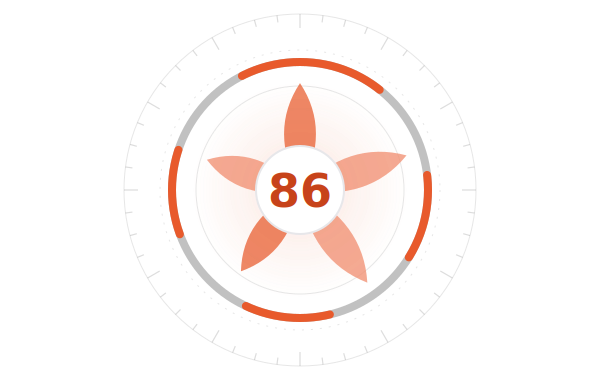
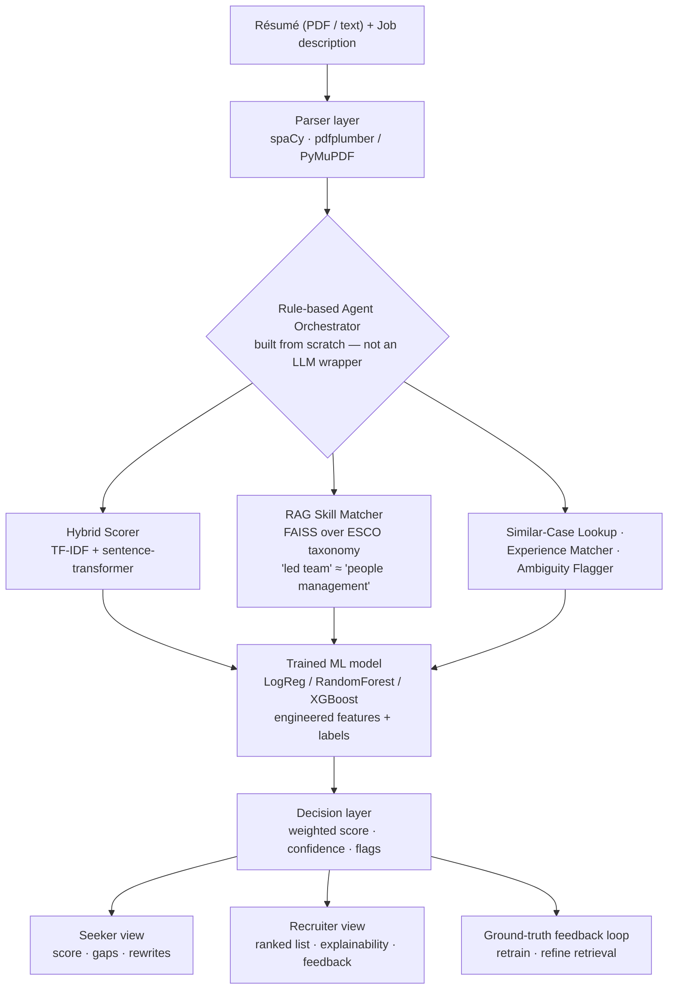

<div align="center">

<picture>
  <source media="(prefers-color-scheme: dark)" srcset="docs/hero-bloom-dark.svg">
  
</picture>

# HireLens

**Resume intelligence, brought into focus.**

*A two-sided AI platform that scores, ranks, and — above all — **explains** résumé-to-job fit.*

</div>

---

> *Every résumé is a person, slightly out of focus.*

For six seconds, a stranger decides your future. Software spent a decade making that worse — matching keywords, discarding meaning, handing back a number with no reason attached. Job seekers never learn *why*. Recruiters can't defend *how*.

**HireLens is a lens.** It reads for meaning, not spelling. It scores, then shows its work. And in the one moment that matters, it blooms the answer open like a camera aperture — five petals, each one a real signal the model weighed — so the art on the screen *is* the explanation.

One engine. Two temperaments. A calm coaching room for the person; a fast, honest cockpit for the recruiter. Same warm light through both.

---

## Two sides, one engine

|  | **The job seeker** | **The recruiter** |
|---|---|---|
| Asks | *"Will I pass? What do I fix?"* | *"Rank these fifty, fast — and let me justify it."* |
| Gets | Fit score · gap report · rewrite tips · rescan-and-watch-it-climb · a no-JD résumé health check · blind-mode bias check | Batch ranking · per-candidate explainability · editable feedback notes · tunable weights · an accuracy dashboard |
| Feels | anxiety ↓ | time ↓ |

Both are served by the **same core AI** — a deliberate architecture decision (shared brain, differentiated experience), the way real products like Jobscan and Teal are actually built.

---

## The trick worth stealing

Most tools return a number. HireLens returns a **flower** — and the flower is not decoration.

The five petals *are* the model's live feature vector: **lexical**, **semantic**, **skills overlap**, **experience**, **education**. Petal reach is signal strength. A skills-heavy candidate and an experience-heavy candidate bloom into visibly different flowers. The pupil is the score; the ring is confidence, drawn as a partial arc — a near-complete ring means *sure*, a short arc means *"we could only read part of this résumé,"* said plainly.

The art carries the data. Screenshot-able, self-explaining, and impossible to fake.

---

## Under the glass

Scoring and ranking are made **entirely** by self-built, trainable, deterministic components — TF-IDF, embeddings, RAG retrieval, and a trained classifier. An LLM, if used at all, only paraphrases the final explanation into natural language. **It never makes the ranking decision.**



### Three layers of AI — and which ones we actually trained

The line that answers every capstone reviewer's first question:

| Layer | Component | Trained by us? | Why it's here |
|---|---|---|---|
| Statistical | TF-IDF vectorizer | **Yes** — fit on the résumé/JD corpus | Lexical / keyword matching |
| Pretrained | `all-MiniLM-L6-v2` (sentence-transformers) | No — used as-is (normal, expected) | Semantic meaning |
| **Trained ML** | LogReg / RandomForest / XGBoost | **Yes** — on engineered features + ground-truth labels | Final fit score + feature importance |

### Honesty, engineered in

- **Parsing confidence ≠ scoring confidence.** Kept strictly separate, so a bad score is always traceable to *"we couldn't read it"* vs *"genuine mismatch."*
- **Score versioning** — every result logs the pipeline version that produced it (`v3-hybrid`, …), so accuracy is measurable version-over-version.
- **Guardrails** — empty, image-only, non-English, and garbage PDFs are refused with warm, specific errors, never a red stack trace.
- **Privacy** — résumés are read for the session only; recruiter routes are HTTP-Basic auth'd and account-scoped; blind mode strips name, photo, gender terms, and university *before* scoring and shows exactly what it removed.

---

## Proof, not vibes

Rigor is the graded substance, so it isn't hidden:

- **Metrics** — Spearman rank correlation, Precision@5 / @10, NDCG, and classification metrics against a human-labeled ground-truth set.
- **Ablation study** — TF-IDF only → embeddings only → hybrid → hybrid + RAG → full pipeline + trained re-ranker, reported as a rising curve. The progression *is* the evaluation deliverable.
- **Small-data honesty** — with ~20–30 labeled pairs, we use k-fold cross-validation and seed-variance stability, and the accuracy dashboard shows sample size and confidence intervals rather than pretending the set is large.
- **Fairness** — swap only the name (`John → Priya`); the score should not move. If it does, that's reported as a discovered limitation, in the UI and the report.

The evaluation harness, ablation runner, k-fold, grid-search tuning, and model training are all built and wired; the dashboard renders the **honest current state** and lights up the moment real human ratings land — because faking the numbers would betray the one principle the whole product is built on.

---

## The craft — "Into Focus" design system

The interface behaves like a lens.

- **Two rooms.** A true-white **Lightbox** and a film-black **Darkroom**, toggled and remembered. The world is graphite and paper; **Ember and the aperture bloom are the only color** — so they carry all the warmth.
- **You are the lens.** A soft pool of light follows your cursor and the bloom leans toward it — never blurring a single word (clarity is sacred).
- **One signature moment.** The score doesn't count up; it *blooms* and resolves from blur, then holds perfectly still — a logo, not a screensaver.
- **Type & tone.** Fraunces for the editorial headlines, Hanken Grotesk for everything precise, tabular numerals wherever numbers matter. Gaps are phrased as to-dos, failures are the system's fault, confidence is spoken plainly.
- **Accessible by floor.** WCAG 2.1 AA throughout, non-suppressible focus rings, every effect honoring `prefers-reduced-motion`.

---

## Run it

**Prerequisites:** Python 3.11+, Node 20+.

**Backend** — FastAPI, port 8000

```bash
cd backend
python -m venv .venv && source .venv/Scripts/activate   # Windows Git Bash; use bin/activate on macOS/Linux
pip install -r requirements.txt
python -m spacy download en_core_web_sm
uvicorn app.main:app --reload --port 8000
```

**Frontend** — React + Vite, port 3000

```bash
cd frontend
npm install
npm run dev
```

Open **http://localhost:3000**. Recruiter tools use a demo login — `recruiter_one` / `password123`.

**Tests**

```bash
cd backend  && pytest      # 39 backend test modules
cd frontend && npm test    # Vitest — ranking, health heuristics, confidence bands, API mapping
```

**API surface** — `POST /parse` · `POST /score` · `POST /rank` · `POST /feedback` · `GET /metrics` · `GET /health`

---

## The map

```
hirelens/
├── backend/                    FastAPI · the whole brain
│   └── app/
│       ├── api/v1/             /parse /score /rank /feedback /metrics
│       ├── core/               config · auth · pipeline registry
│       ├── schemas/            locked data contracts (feature vector, scoring, ranking…)
│       └── services/           extraction · structuring · scoring · rag · ranking ·
│                               orchestration · evaluation · confidence · privacy · ratelimit
├── frontend/                   React + Vite · the "Into Focus" interface
│   └── src/
│       ├── components/         aperture bloom · rings · UI kit · explainability panel
│       ├── pages/              seeker (analyze · rescan · health · blind) · recruiter (batch · ranked · dashboard)
│       ├── lib/                api · atmosphere (cursor-light) · confidence · résumé health
│       └── index.css           the token spine — two rooms, one warm light
├── data/                       ground truth · ESCO taxonomy · processed indexes
└── docs/                       architecture notes · this README's art
```

---

## Honest limitations & roadmap

Maturity is knowing what isn't done:

- **Ground truth is small and still being collected.** Every evaluation number is gated on real human ratings; the pipeline to compute them is built and waiting. Stated as proof-of-concept scale, not hidden.
- **CPU-bound embedding** of very large batches is slow; the fix (batch embedding + a background queue) is named and partially in place, not fully built.
- **The LLM polish layer** (natural-language feedback) is optional and off by default — the core stays deterministic and self-built on purpose.

Next: close the evaluation loop on real labels, ship the ablation and feature-importance charts to the live dashboard, and deploy.

---

## Colophon

**Backend** — FastAPI · spaCy · scikit-learn · sentence-transformers · FAISS · XGBoost · SQLite
**Frontend** — React · Vite · Tailwind · a hand-built design system
**Datasets** — Kaggle résumé & job-posting corpora · ESCO skill taxonomy — all free
**Everything free to build, free to host.**

<div align="center">

*One engine, two temperaments, one moment where fit comes into focus.*

</div>
